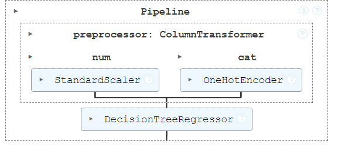

# Data Science Midterm Project

## Project/Goals

The aim of this project was to predict house prices using various attributes such as square footage, number of bedrooms, and number of bathrooms. We implemented and explored different supervised learning regression models to accomplish this task. The performance of these models was evaluated using various metrics, which helped us determine the most suitable model and parameters for this prediction task.

## Process
## Data Cleaning

### Source of Data
The dataset includes various features relevant to predicting house prices.

1. Loaded the raw data from JSON files.
2. Merged multiple data sources into a single dataframe.
3. Handled missing values through appropriate methods.
4. Split the data into training and test sets.
5. Converted categorical variables into numerical format using encoding techniques.

## Exploratory Data Analysis (EDA)

### Notebooks
- EDA steps are documented in `notebooks/1 - EDA.ipynb`.

### Steps 
1. Analyzed the distribution of key features.
2. Examined relationships between features and the target variable (house prices).
3. Identified potential outliers and anomalies.

## Model Selection

### Notebooks
- Model selection steps are documented in `notebooks/2 - model_selection.ipynb`.

### Models Tested:
1. Decision Tree
2. Random Forest
3. XGBoost
4. Other relevant regression models

### Steps
1. Split the training data into training and validation sets.
2. Trained multiple models on the training set.
3. Evaluated models using metrics such as Mean Absolute Error (MAE), Root Mean Squared Error (MSE), and R-squared.
4. Selected the best-performing models for further tuning.

## Model Tuning

### Notebooks
- Tuning steps are documented in `notebooks/3 - tuning_pipeline.ipynb`.

### Steps:
1. Hyperparameter tuning using techniques such as Grid Search and Random Search.
2. Validated model performance using cross-validation.
3. Finalized the best model based on performance metrics.
4. Compared different tuned models to determine the best performer.
5. Selected the best model for feature selection.

## Feature Selection

### Notebooks
- Feature selection steps are documented in `notebooks/3 - tuning_pipeline.ipynb`.

### Actions Taken:
1. Analyzed the top 10 important features of the best model.
2. Used visualization for the top features
3. Chose the best model to move on to the final pipeline.

## MLOps Pipeline
### Steps:
1. Created a scalable pipeline for model training and deployment.
2. Automated the data preprocessing, model training, and evaluation process.
3. Saved the final model/pipeline for deployment.

## Results

### Best Performing Model: Decision Tree Regressor

- **Root Mean Squared Error (MSE):** 44555.6
- **Mean Absolute Error (MAE):** 7110.6
- **R² Score:** 0.993517

This repository provides the complete workflow for predicting house prices, from data cleaning to deploying the final model. Each step is documented in detail to ensure reproducibility and ease of understanding.

## Challenges 

1. Collaborating with group member using Github: Lack of experience with GitHub requires more communication between team members which requires more time to get work done
2. Encoding tags from huge list 
3. Target encoding of city, understanding how to prevent data leakage 
4. Hyperparameter tuning and understanding what to change 

## Future Goals

1. Target encoding of city using appropriate Pandas methods
2. Refine hyperparameters
3. Refine pipeline 
4. More EDA and interactive plots for better visualization 
5. Gain more exposure to team work on GitHub
6. Use references from existing projects related to our project and improve our models
